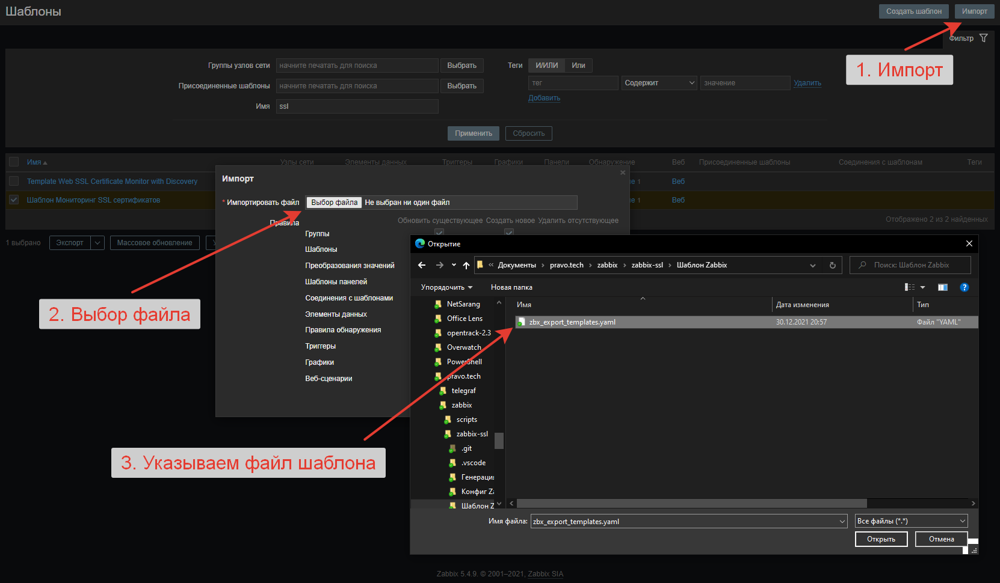
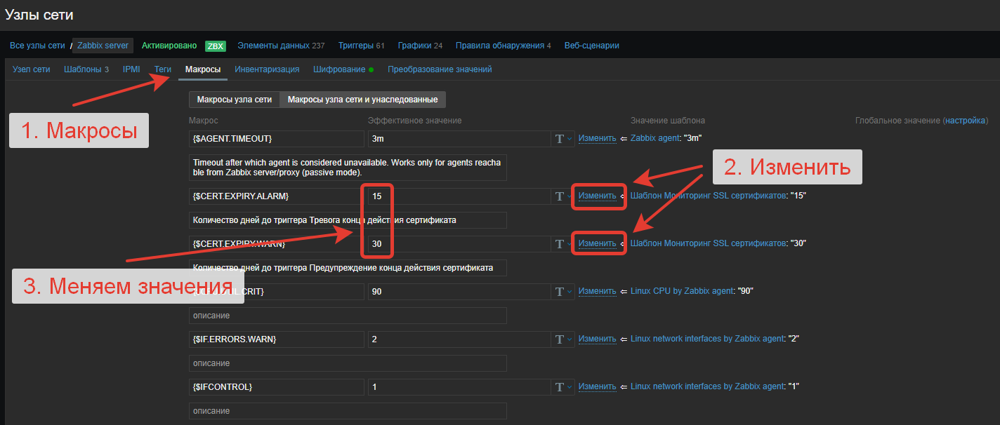

<!-- omit in toc -->
# Zabbix - мониторинг SSL

Мониторим SSL сертификаты с помощью списка сайтов и портов, а так же, Zabbix Agent2.

1. [Минимальные требования](#минимальные-требования)
2. [Генерация списка сайтов](#генерация-списка-сайтов)
3. [Установка](#установка)
   1. [Установка Zabbix Agent2](#установка-zabbix-agent2)
   2. [Пути к файлам конфигурации](#пути-к-файлам-конфигурации)
   3. [Импорт шаблона и настройка](#импорт-шаблона-и-настройка)
   4. [Проверка конфигурации Агента](#проверка-конфигурации-агента)
   5. [Включение автозапуска Агента](#включение-автозапуска-агента)
4. [Примечания](#примечания)

## Минимальные требования
1. Linux (Debian style, хотя я не тестировал на других, но должно везде работать)
2. Zabbix Server не ниже версии 5.4
3. Zabbix Agent2 не ниже версии 5.4
4. PowerShell не ниже версии 5 для скрипта генерации списка сайтов для монторинга

## Генерация списка сайтов
- *.\Генерация списка сайтов\SiteList.csv* - сюда вносим список сайтов и портов TCP. Кодировка Default, разделитель ";".
- Далее запускаем скрипт *.\Генерация списка сайтов\Generate_Site_List.ps1*. Он создаст JSON со списком сайтов в формате понятному Zabbix. Обратите внимание что Zabbix понимает только кодировку **UT8-без-BOM**. **Это важно** - если будете менять JSON под Windows, то есть шанс сохранить его в кодировке UTF8-BOM, и Zabbix перестанет его понимать, всё поломается, Карл.
- Полученный файл сохраняется по пути *.\Конфиг Zabbix Agent2\scripts\ssl_sites_list.json*. Его копируем на сервер откуда будет производиться проверка. Путь по умолчанию: */etc/zabbix/scripts/ssl_sites_list.json*
## Установка
### Установка Zabbix Agent2
Пример для Ubuntu 20.04 LTS. Для других ОС варианты здесь - https://www.zabbix.com/ru/download?zabbix=5.4<br>
```shell
# Скачиваем файл установки репозитория
wget https://repo.zabbix.com/zabbix/5.4/ubuntu/pool/main/z/zabbix-release/zabbix-release_5.4-1+ubuntu20.04_all.deb
# И устанавливаем его
sudo dpkg -i zabbix-release_5.4-1+ubuntu20.04_all.deb
# Обновляем список доступных программ репозитория и устанавливаем агента
sudo apt update && sudo apt install sudo apt install zabbix-agent2 -y
```
### Пути к файлам конфигурации
Далее копируем файлы конфигурации:<br>
- Список сайтов копируем сюда - */etc/zabbix/scripts/ssl_sites_list.json*
- *.\Конфиг Zabbix Agent2\userparameters_ssl_cert_check.conf* копируем сюда - */etc/zabbix/zabbix_agent2.d/*
### Импорт шаблона и настройка
- Импортируем шаблон Zabbix:
  - В разделе "Шаблоны" нажимаем кнопку "Импорт" и указываем файл шаблона - *.\Шаблон Zabbix\zbx_export_templates.yaml*<br>
  - По умолчанию триггер "Предупреждение" срабатывает за 30 дней до конца срока сертификата, а триггер "Тревога" срабатывает за 15 дней, но эти параметры можно изменить. Добавляем шаблон к хосту и переходим в раздел "Макросы"<br><br>Формат числа = день.
### Проверка конфигурации Агента
- Для проверки выполните команду:
```shell
zabbix_agent2 -c /etc/zabbix/zabbix_agent2.d/userparameters_ssl_cert_check.conf -t 'ssl.sites.list'
```
В терминале должен появится список сайтов в формате JSON и код выхода программы должен равняться 0:
```
ssl.sites.list                                [s|{
    "data":  [
                 {
                     "{#SITEADDRESS}":  "pravo.ru.case.one",
                     "{#SITEPORT}":  "443"
                 },
                 {
                     "{#SITEADDRESS}":  "fin.ru.case.one",
                     "{#SITEPORT}":  "443"
                 }
             ]
}]
```
### Включение автозапуска Агента
- Включаем автозапуск Агента:
```shell
sudo systemctl enable zabbix-agent2
```
- Перезапускаем его если тест конфигурации прошёл успешно:
```shell
sudo systemctl restart zabbix-agent2
```
## Примечания
- Всё пути меняются и жёстко не привязаны. Где хотите, там и храните конфигурации
- Если нужен перевод шаблона на другой язык, то создавайте Issue